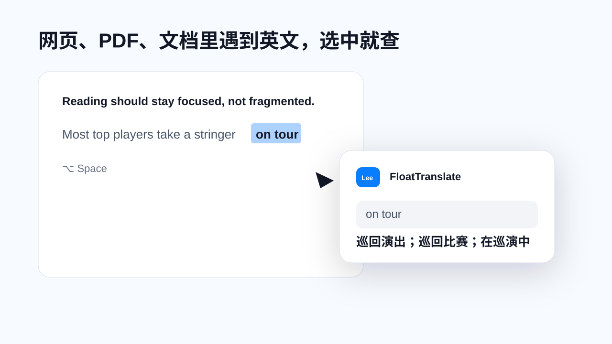
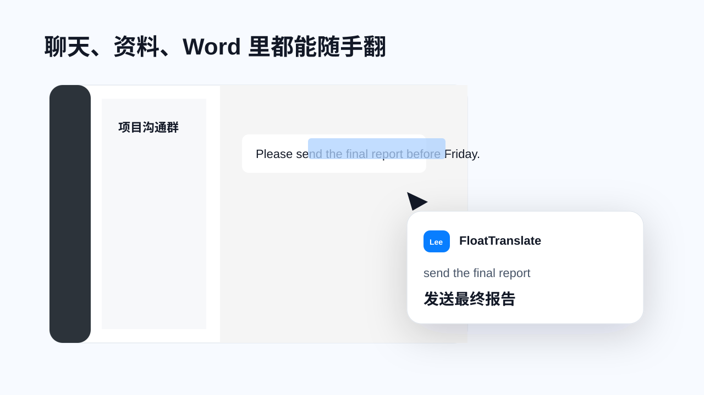

# FloatTranslate Promo Video

这是 FloatTranslate 的横屏宣传视频源码，面向所有经常需要处理中英文内容的 Mac 用户：学生、办公用户、研究者、老师、内容创作者，以及任何会在 Word、PDF、网页、聊天软件里临时遇到英文的人。

它想表达的核心不是“又一个翻译软件”，而是：**选中文字，按下快捷键，翻译、词典和朗读就在当前内容旁边出现，不用复制粘贴，不用切换窗口。**

## 产品定位

FloatTranslate 是一个 macOS 划词翻译工具，重点解决三件事：

- 看英文时：选中句子或单词，直接获得中文解释
- 学发音时：查看音标，并分别播放英音和美音
- 写英文时：选中中文表达，快速得到英文参考

适合的使用场景包括：

- 阅读英文网页、PDF、论文、产品文档
- 在 Word、PPT、聊天软件中处理英文资料
- 看英文通知、邮件、任务说明
- 学习单词、短语、句子发音
- 中英文写作和表达辅助

## 场景示例

### 1. 网页、PDF、文档里遇到英文



用户在当前内容里选中 `on tour`，按下 `⌥ Space`，翻译面板直接出现在旁边。重点是“不复制、不跳转、不打断阅读”。

### 2. 单词发音和词典解释


单词 `skill` 展示英音、美音音标，并提供英音和美音播放按钮。这个场景突出“看懂意思后，还能马上听发音”。

### 3. 聊天、资料、Word 里随手翻



不管英文出现在聊天软件、资料文档还是办公软件里，都可以直接选中后翻译。这个场景突出 FloatTranslate 的跨应用能力。

## 视频结构

| 时间 | 场景 | 作用 |
| --- | --- | --- |
| 0-3.5s | 阅读英文时被短语卡住 | 建立“复制翻译很打断”的痛点 |
| 3.1-6.9s | 选中短语，快捷键唤起面板 | 展示核心操作路径 |
| 6.5-10.5s | `skill` 英音/美音播放 | 展示朗读和词典价值 |
| 10.1-13.9s | 中文句子翻译成英文 | 展示写作和表达辅助 |
| 13.5-17.3s | 聊天软件里的英文资料 | 展示跨应用翻译能力 |
| 16.9-20.6s | 阅读、跟读、写作、资料四卡总结 | 汇总高频使用场景 |
| 20.2-24s | 下载 CTA | 收束到产品行动 |

## 文件说明

- `index.html`：视频画面、动效、字幕和场景脚本
- `hyperframes.json`：HyperFrames 入口配置
- `design.md`：设计方向说明
- `package.json`：本地渲染脚本
- `docs/*.svg`：GitHub 可直接预览的场景示例图

## 本地预览

```bash
npx hyperframes preview
```

## 本地渲染

```bash
npx hyperframes render
```

## 后续可以继续补的内容

- 把最终 `.mp4` 上传到 GitHub Releases 或官网，然后在这里补下载链接
- 增加竖屏短视频版，适配抖音、小红书、视频号
- 增加办公场景版本：邮件、会议纪要、产品文档、海外资料
- 增加学习场景版本：单词、短语、句子朗读、阅读理解
- 增加官网下载页说明：未公证版安装方式、权限说明、常见问题

## 注意

当前 GitHub 连接器已上传文本源码和 SVG 示例图。音频素材和最终导出的 `.mp4` 属于二进制文件，建议后续放到 GitHub Releases、官网下载目录或云盘，再在这里补链接。
