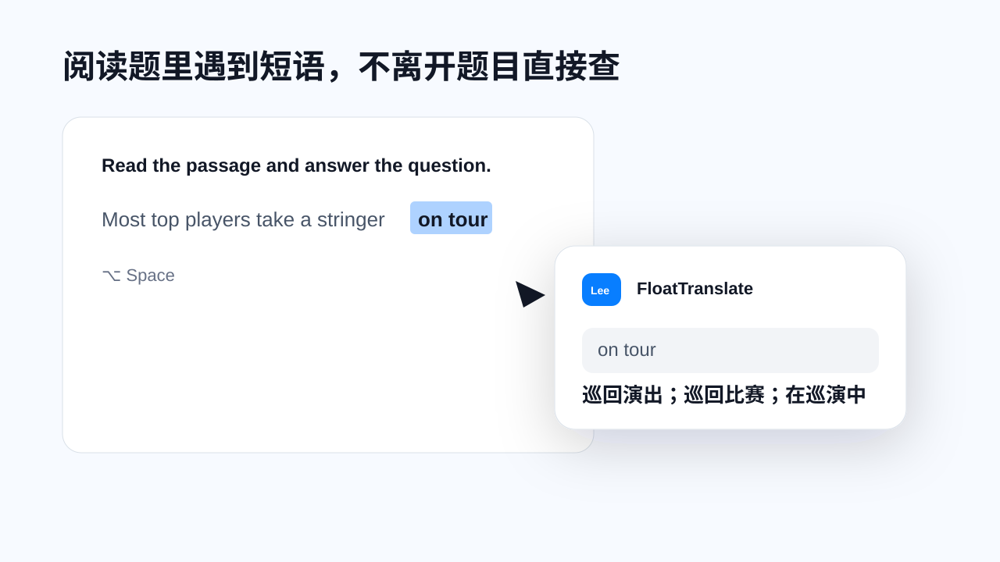
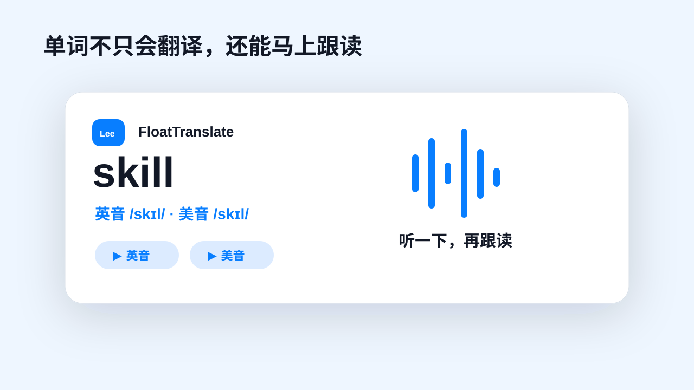

# FloatTranslate K12 Promo Video

这是 FloatTranslate 面向 K12 学习场景的横屏宣传视频源码。它不是单纯展示软件界面，而是把学生真实学习时的几个小卡点拍出来：阅读题里遇到短语、单词不会读、英语作文表达卡住、老师在微信里发英文资料。

核心想表达的是一句话：**选中文字，按下快捷键，翻译和朗读就在当前内容旁边出现，不打断学习节奏。**

## 为什么这样设计

K12 用户不是为了“研究翻译软件”才打开工具，他们通常是在做题、写作文、看老师资料时突然卡住。所以视频重点不是讲参数，而是制造这种画面感：

- “哇，不用复制到别的软件？”
- “原来这个短语可以贴着题目翻译。”
- “这个单词不只知道意思，还能马上听英音/美音。”
- “微信里的英文资料也不用切来切去。”

## 场景示例

### 1. 阅读题里查短语



学生在阅读理解里选中 `on tour`，按下 `⌥ Space`，翻译面板直接出现在题目旁边。重点是“不离开题目，不打断上下文”。

### 2. 单词跟读



单词 `skill` 展示英音、美音音标，并提供英音和美音播放按钮。这个场景突出“查完意思顺手听一遍”，更贴近学生背词和跟读。

### 3. 微信资料翻译


老师在班级群里发英文任务，学生不用复制到网页翻译，选中后直接在微信旁边看懂。

## 视频结构

| 时间 | 场景 | 作用 |
| --- | --- | --- |
| 0-3.5s | 英语阅读题卡住 | 建立 K12 学习痛点 |
| 3.1-6.9s | 选中短语，快捷键唤起面板 | 展示核心操作路径 |
| 6.5-10.5s | `skill` 英美发音 | 展示朗读和词典价值 |
| 10.1-13.9s | 中文作文句子翻译成英文 | 展示写作辅助 |
| 13.5-17.3s | 微信班级群英文资料 | 展示跨应用能力 |
| 16.9-20.6s | 阅读、跟读、写作、资料四卡总结 | 汇总使用场景 |
| 20.2-24s | 下载 CTA | 收束到产品行动 |

## 文件说明

- `index.html`：视频画面、动效、字幕和场景脚本
- `hyperframes.json`：HyperFrames 入口配置
- `design.md`：设计方向说明
- `package.json`：本地渲染脚本
- `docs/*.svg`：GitHub 可直接预览的场景示例图

## 本地预览

```bash
npx hyperframes preview
```

## 本地渲染

```bash
npx hyperframes render
```

## 后续可以继续补的内容

- 把最终 `.mp4` 上传到 GitHub Releases 或官网，然后在这里补下载链接
- 增加竖屏抖音版，适配 1080x1920
- 增加家长视角版本：强调孩子做题不分心、查词更顺
- 增加老师视角版本：强调资料阅读、课后自学、跟读练习

## 注意

当前 GitHub 连接器已上传文本源码和 SVG 示例图。音频素材和最终导出的 `.mp4` 属于二进制文件，建议后续放到 GitHub Releases、官网下载目录或云盘，再在这里补链接。
